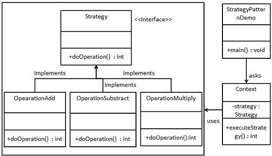

# Strategy Pattern
---
## 1. Strategy Pattern là gì?

👉 Strategy = đóng gói các thuật toán thành các class riêng biệt, và có thể hoán đổi chúng tại runtime

Ý tưởng cốt lõi:
- Tách “làm gì” (interface) khỏi “làm như thế nào” (implementation)
- Tránh if-else / switch-case phình to
---
## 2. Cấu trúc (Structure)

Strategy có 3 thành phần chính:

 - Strategy (interface)

<pre>
public interface IPaymentStrategy
{
    void Pay(decimal amount);
}
</pre>
---
 - ConcreteStrategy (các class implement Strategy)
<pre>
public class MomoPayment : IPaymentStrategy
{
    public void Pay(decimal amount)
    {
        Console.WriteLine("Pay bằng Momo");
    }
}

public class BankPayment : IPaymentStrategy
{
    public void Pay(decimal amount)
    {
        Console.WriteLine("Pay bằng Bank");
    }
}
</pre>
---
 - Context (nơi sử dụng strategy)
<pre>
public class PaymentContext
{
    private IPaymentStrategy _strategy;

    public PaymentContext(IPaymentStrategy strategy)
    {
        _strategy = strategy;
    }

    public void Execute(decimal amount)
    {
        _strategy.Pay(amount);
    }
}
</pre>
---
 - Sử dụng
<pre>
var context = new PaymentContext(new MomoPayment());
context.Execute(1000);
</pre>

 👉 Muốn đổi logic → chỉ cần đổi strategy

 

 ---
 ### 3. Bản chất vấn đề Strategy giải quyết

 ❌ Không dùng Strategy (code thường gặp)

 <pre>
 public void Pay(string type)
{
    if(type == "MOMO") { ... }
    else if(type == "BANK") { ... }
    else if(type == "VISA") { ... }
}
 </pre>

Vấn đề:
 - Vi phạm Open/Closed Principle
 - Code phình to theo thời gian
 - Khó test từng logic riêng
 - Dễ bug khi sửa
 ---
✅ Dùng Strategy

👉 Mỗi logic = 1 class riêng

👉 Không cần sửa code cũ khi thêm logic mới

---
### 4. Khi nào nên dùng Strategy?
✔ 1. Có nhiều cách xử lý cho cùng 1 hành vi

Ví dụ:
 - Payment (Momo, Bank, Visa)
 - Tính giá (discount khác nhau)
 - Sort (quick sort, merge sort)
 - Validate rule
 ---
 ✔ 2. Có nhiều if-else / switch-case

 Dấu hiệu rõ ràng nhất:

 <pre>
 if(type == "A") ...
 else if(type == "B") ...
 else if(type == "C") ...
 </pre>

 👉 Đây là “mùi code” (code smell)

 ---

 ✔ 3. Muốn thay đổi logic runtime

 Ví dụ:

 - User chọn phương thức thanh toán
 - Config quyết định thuật toán

 ---

 ✔ 4. Muốn test từng logic độc lập

 👉 Mỗi strategy test riêng → dễ unit test

 ---
 ✔ 5. Logic có thể mở rộng trong tương lai

 👉 Đây là lý do quan trọng nhất

 ---
### 5. Khi KHÔNG nên dùng Strategy?

❌ 1. Logic rất đơn giản

Nếu chỉ có 2-3 cách xử lý, và logic đơn giản → dùng if-else vẫn ổn

--
❌ 2. Không có khả năng thay đổi / mở rộng
Nếu:

 - Chỉ có 1–2 trường hợp
 - Không bao giờ thêm mới

👉 Không cần tách class

---
❌ 3. Tạo quá nhiều class nhỏ
Strategy có nhược điểm:

👉 “Class explosion” (bùng nổ class)

Ví dụ:

 - 10 loại payment → 10 class

Nếu project nhỏ → khó quản lý

❌ 4. Logic phụ thuộc chặt context

